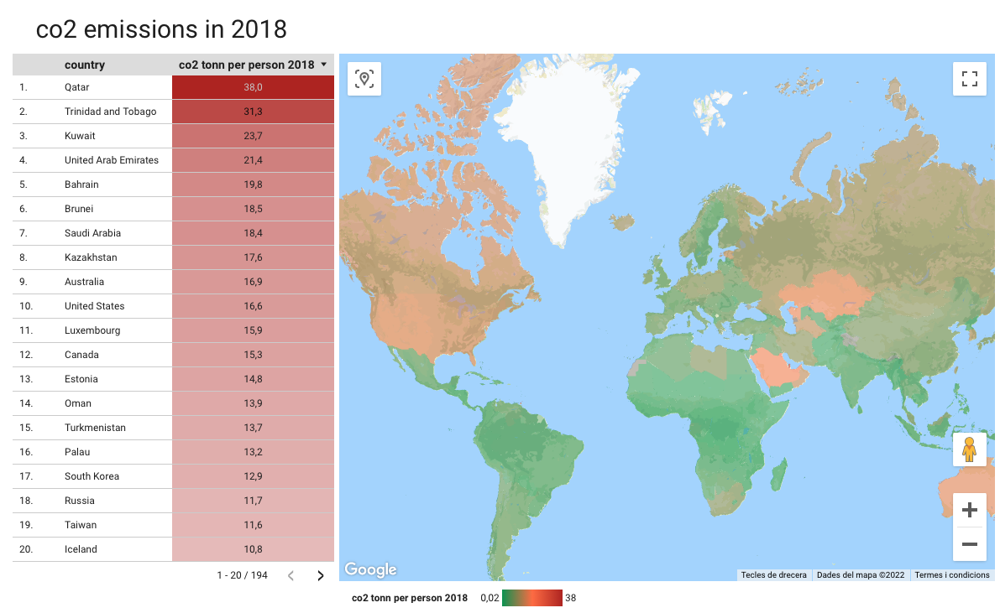

Resultats de la PAC 2:

***********************************************************************
 

Font de dades: [https://www.kaggle.com/datasets/iabhishekofficial/mobile-price-classification?select=test.csv](https://www.kaggle.com/datasets/iabhishekofficial/mobile-price-classification?select=test.csv)

***********************************************************************
 

Font de dades: [https://www.kaggle.com/datasets/iabhishekofficial/mobile-price-classification?select=test.csv](https://www.kaggle.com/datasets/iabhishekofficial/mobile-price-classification?select=test.csv)

***********************************************************************
 
 
 
[Enllaç al cartograma interactiu a Google Data Studio](https://datastudio.google.com/s/qjEKM4nD8aU)

Font de dades: [https://www.gapminder.org/data/](https://www.gapminder.org/data/)

***********************************************************************
