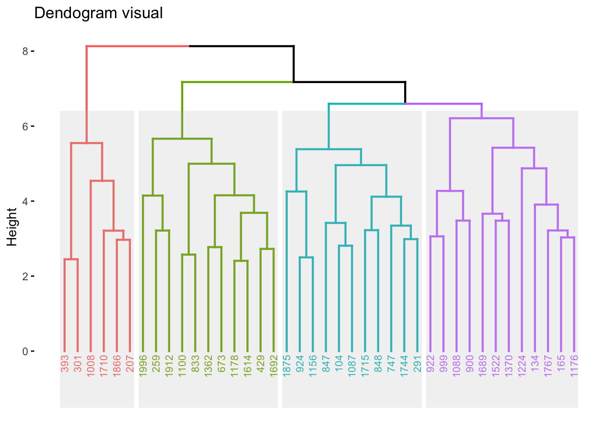
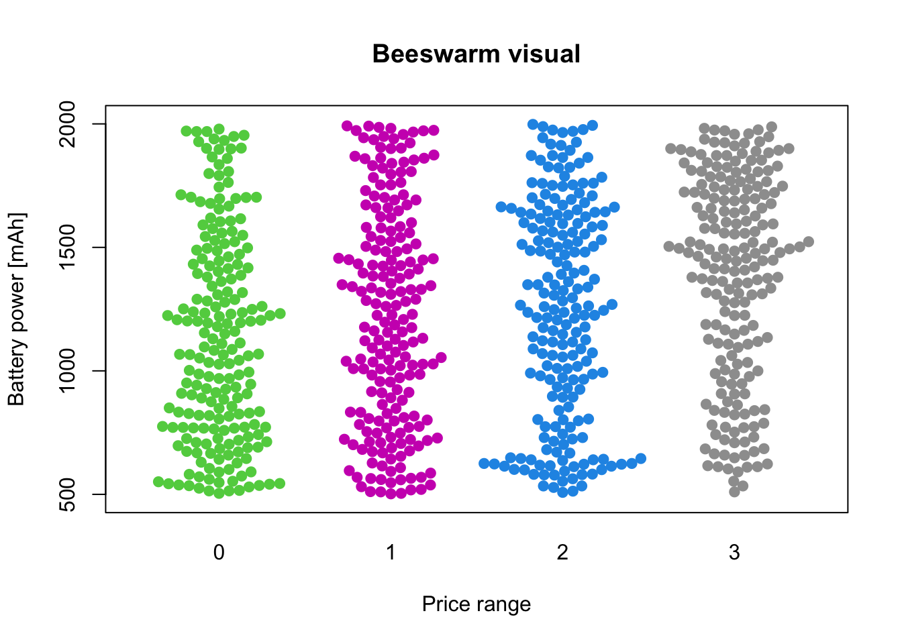

In this page you will see two visualizations for pac_2. Dendogram and Beeswarm.

* Dendograma:

font de dades(https://www.kaggle.com/datasets/iabhishekofficial/mobile-price-classification?select=test.csv)

* Beeswarm:

font de dades(https://www.kaggle.com/datasets/iabhishekofficial/mobile-price-classification?select=test.csv)

* Cartograma:
enllaç:(https://datastudio.google.com/s/qjEKM4nD8aU)
font de dades(https://www.gapminder.org/data/)
